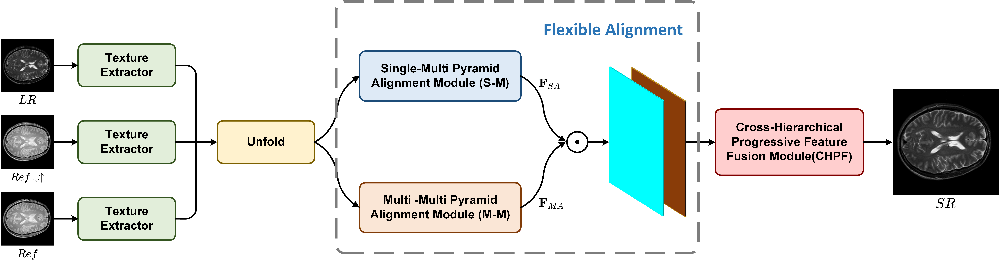
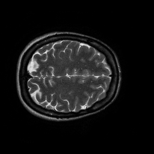
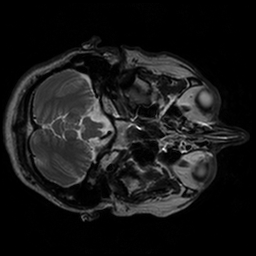
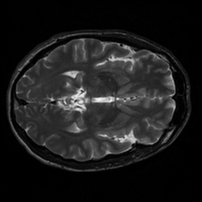
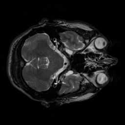
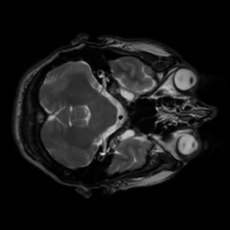

# Flexible Alignment Super-Resolution Network for Multi-Contrast MRI (FASR-Net)

## Contents

- [Declaration](#Declaration)

- [Models](#Models)
- [Datasets](#Datasets)
- [Demo Results](#Demo-Results)
- [Requirements and dependencies](#Requirements-and-Dependencies)

- [Quick Test](#Quick-Test)
&nbsp;

<p align="center">

</p>
&nbsp;

## Declaration

​		For confidential reasons, we only demonstrate our testing codes to demonstrate the authenticity and excellence of our methods. If the paper is officially published, we will update our training code.

## Models

​	We provide our pre-trained model FASR-IXI.pt for IXI on [baidu cloud](https://pan.baidu.com/s/1fPZRYAJkd9EZB27IFj5Bkg) (spjj). 

​	The model for Fastmri will be updated if the paper is officially published.

## Datasets

​	In this paper, we conduct two experiments on two public datasets: IXI and Fastmri.

​	The IXI dataset can be downloaded from [IXI](https://brain-development.org/ixi-dataset/).

​	The Fastmri dataset can be downloaded from [Fastmri](https://fastmri.org/).

## Demo Results
   To save the time for downloading the datasets, we provide some images in folder "demo". Some reconstruction results will be generated by this code.
   The images on the left are ground-truth, the images on the right are super-resolution images produced by our method.

    

  
 

## Requirements and Dependencies

* python 3.7 (recommend to use [Anaconda](https://www.anaconda.com/))
* python packages: `pip install opencv-python imageio`
* pytorch >= 1.1.0
* torchvision >= 0.4.0

## Quick Test

1.  Clone the github repo.

   ```
   git clone https://github.com/yimingliu123/FASR-Net.git
   cd FASR-Net
   ```

2.  Place the pre-trained model in the proper location and modify "model_path" in test.sh.

3.  Run test.sh. The results will be generated in the "test" folder.

   ```
   sh test.sh
   ```

